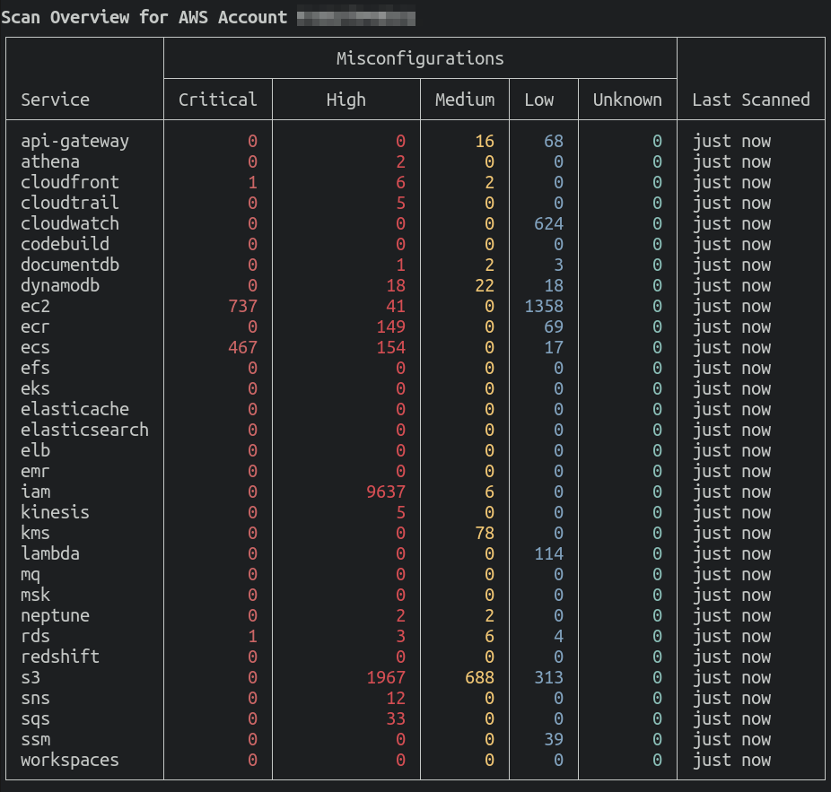

# Amazon Web Services

!!! warning "EXPERIMENTAL"
    This feature might change without preserving backwards compatibility.

The Trivy AWS CLI allows you to scan your AWS account for misconfigurations. You can either run the CLI locally or integrate it into your CI/CD pipeline. 

Whilst you can already scan the infrastructure-as-code that defines your AWS resources with `trivy config`, you can now scan your live AWS account(s) directly too.

The included checks cover all of the aspects of the [AWS CIS 1.2](https://docs.aws.amazon.com/securityhub/latest/userguide/securityhub-standards-cis.html) automated benchmarks.

Trivy uses the same [authentication methods](https://docs.aws.amazon.com/cli/latest/userguide/cli-chap-configure.html) as the AWS CLI to configure and authenticate your access to the AWS platform.

You will need permissions configured to read all AWS resources - we recommend using a group/role with the `ReadOnlyAccess` policy attached.

Once you've scanned your account, you can run additional commands to filter the results without having to run the entire scan again - results are cached locally per AWS account/region.

## CLI Commands

Scan a full AWS account (all supported services):

```shell
trivy aws --region us-east-1
```

You can allow Trivy to determine the AWS region etc. by using the standard AWS configuration files and environment variables. The `--region` flag overrides these.



The summary view is the default when scanning multiple services.

Scan a specific service:

```shell
trivy aws --service s3
```

Scan multiple services:

```shell
# --service s3,ec2 works too
trivy aws --service s3 --service ec2
```

Show results for a specific AWS resource:

```shell
trivy aws --service s3 --arn arn:aws:s3:::example-bucket
```

All ARNs with detected issues will be displayed when showing results for their associated service.

## Cached Results

By default, Trivy will cache results for each service for 24 hours. This means you can filter and view results for a service without having to wait for the scan to run again. If you want to force the cache to be refreshed with the latest data, you can use `--update-cache`. Or if you'd like to use cached data for a different timeframe, you can specify `--max-cache-age` (e.g. `--max-cache-age 2h`.)
